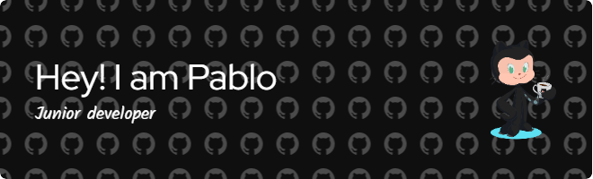

# Hi there👋welcome to my GitHub

  

<!-- 

    

 -->
## 🔎 Connect with me

## 💻 About me
Experiencia en Soporte Técnico.Ingeniero Informático y Analista de HelpDesk de Puebla, México. Especializado en implementar soluciones tecnológicas que optimizan la operación empresarial y aumentan la satisfacción del cliente.

Me considero una persona comprometida con la excelencia. Disfruto de los proyectos que me permiten aplicar mis conocimientos y, al mismo tiempo, aprender algo nuevo.

# 🛠️ Languages and Tools 

## 📋 Programming Languages

## 💾 Databases

## 🎨 Design

## 📚 Frameworks, Platforms and Libraries

## ☁️ Hosting/SaaS

## 💻 IDEs/Editors

## Other

 